# Image-based In-situ Monitoring of 3D Printing with CNNs

Research project conducted at the **Institute of Mechatronic Engineering, TU Dresden**  


---

## Motivation

The proliferation of additive manufacturing is held back by defects and anomalies that develop undetected during printing. Optimising process parameters alone cannot fully address this, which is why **real-time awareness of what is actually being printed** is needed.

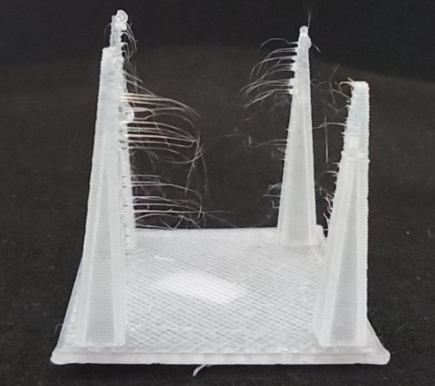

This project equips a 3D printer with a **Laser Line Scanner (LLS)** and trains CNN models to classify each printed layer in real time. A defect detected early allows a feedback controller to pause or correct the print, saving material and time.

---

## Monitoring Workflow

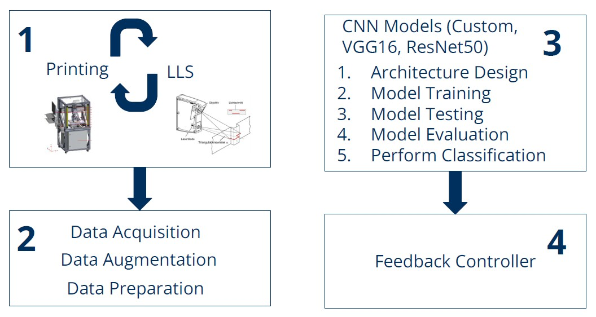

1. The **3D printer** deposits a layer while the **LLS** scans the surface in real time
2. Raw scan data (CSV height maps) undergoes **data preparation and augmentation**
3. A trained **CNN model** classifies the scan into one of the four classes
4. The classification result feeds into a **feedback controller** that can intervene if a defect is detected

CNNs are well suited for this task. They take the LLS scan directly as input and learn to detect patterns and anomalies without any manual feature engineering:

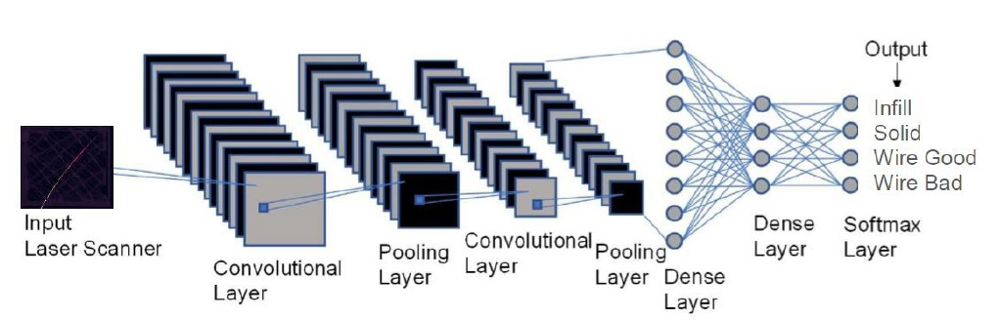

---

## The 4 Classification Classes

The LLS produces a 2D height-profile map for each printed layer. The classifier assigns one of four labels to every scan:

<table>
  <tr>
    <td align="center">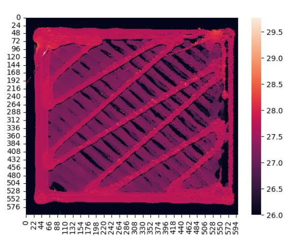<br/><b>Infill</b></td>
    <td align="center">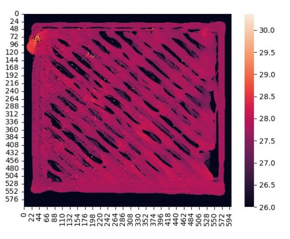<br/><b>Solid</b></td>
  </tr>
  <tr>
    <td align="center">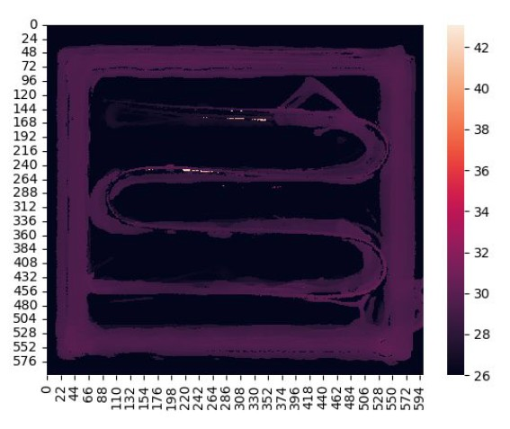<br/><b>Wire Good</b></td>
    <td align="center">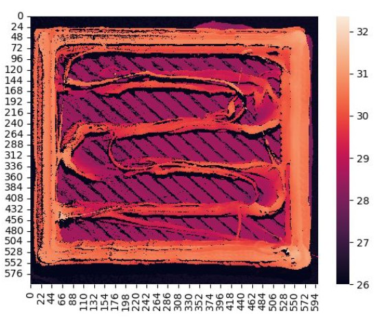<br/><b>Wire Bad</b></td>
  </tr>
</table>

| Label | Description |
|---|---|
| **Infill** | Internal fill pattern of the printed layer |
| **Solid** | Solid top/bottom surface layer |
| **Wire Good** | Correctly printed wire/strand |
| **Wire Bad** | Defective wire, broken or mis-deposited strand |

---

## Dataset & Preprocessing

Raw scans are 2D CSV files where each cell is a height reading in mm from the LLS. A key problem is the presence of zero values in the data. Zeros represent missing scanner readings and must be handled before training.

**Zeros and outliers in the raw CSV:**

<p float="left">
  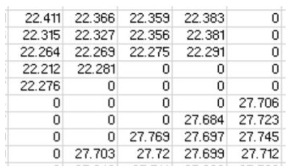
  &nbsp;&nbsp;
  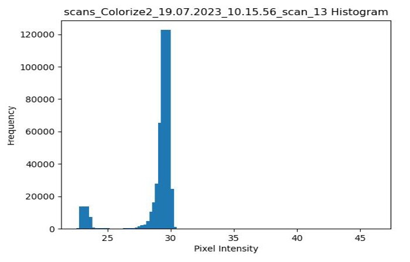
</p>

The histogram reveals a sharp spike near zero (spurious readings) alongside the true height distribution. Zeros are identified by setting min/max thresholds of [1, 40] mm and replacing out-of-range values with the file's (min + max) / 2.

**A raw scan showing the outlier diagonal line before cleaning:**

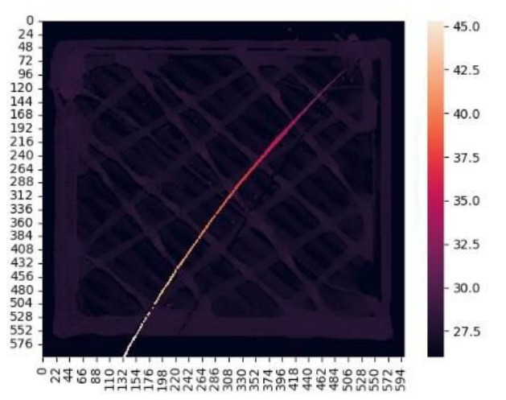

---

## Data Augmentation

The original dataset is small, so an augmentation pipeline is applied to reach a trainable size.

**Step 1: Sliding-window segmentation** - each scan is divided into 9 overlapping 224x224 crops:

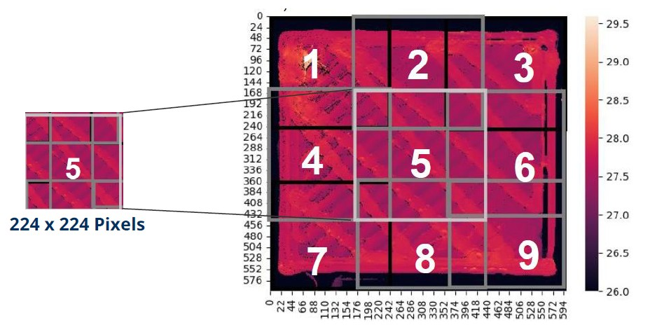

**Step 2: Rotation** - each crop is rotated by 90°, 180°, and 270°, multiplying the dataset by x4:

<p float="left">
  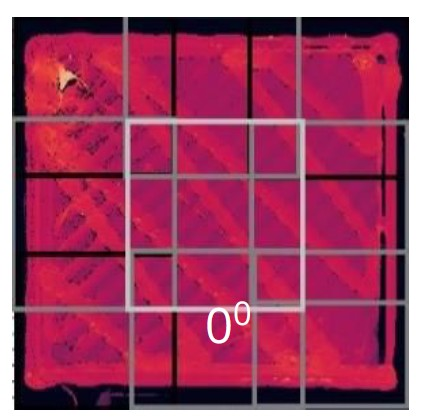
  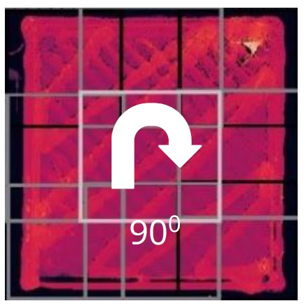
  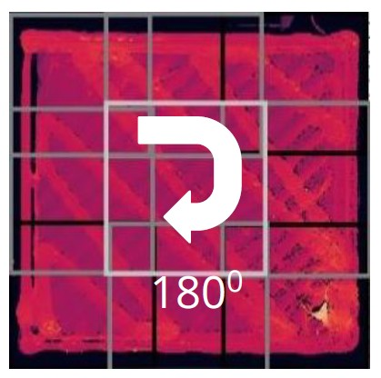
  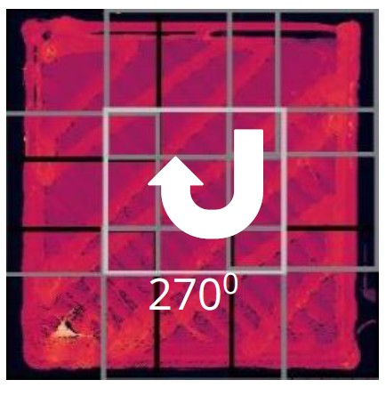
</p>

| Class | Original Files | After Augmentation |
|---|---|---|
| Infill | 85 | 3 060 |
| Solid | 82 | 2 952 |
| Wire Good | 50 | 1 800 |
| Wire Bad | 115 | 4 140 |
| **Total** | **332** | **11 952** |

> The raw dataset is not included in this repository. To request access to the data, contact the author directly (details below).

---

## Model Architectures

Three CNN architectures are trained and compared. All inputs are 224x224 pixels. VGG16 and ResNet50 receive pseudo-RGB input (the grayscale height map repeated 3x) to match their expected input format.

### Custom CNN

Designed from scratch for this task, operates directly on grayscale (1-channel) height maps.

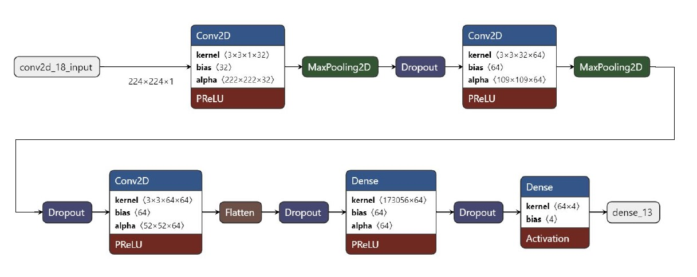

### VGG16 + Custom Top Layer

Pre-trained on ImageNet with the last 10 layers unfrozen for fine-tuning. A custom classification head is stacked on top.

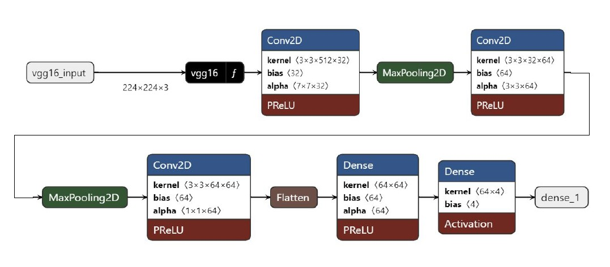

### ResNet50 + Custom Top Layer

Pre-trained on ImageNet with the last 10 layers unfrozen for fine-tuning. Same custom classification head as VGG16.

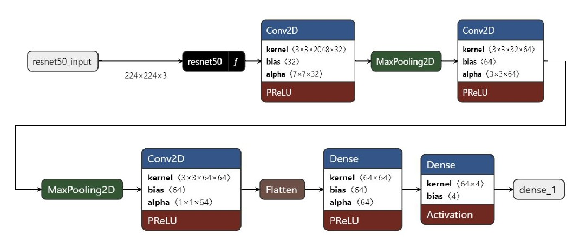

---

## Results

### Custom CNN: 93% Accuracy

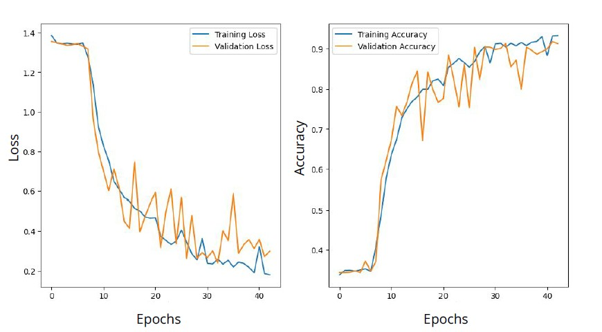

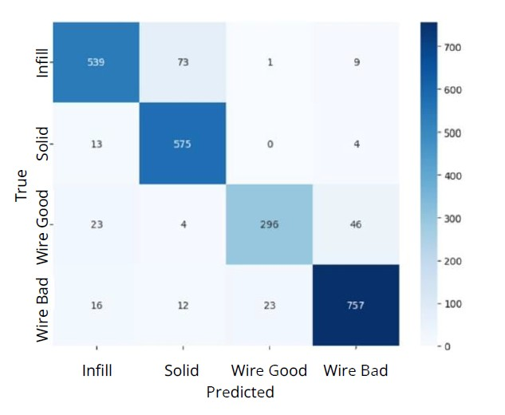

---

## Model Comparison

Per-class performance comparison across all three models (Custom CNN, ResNet50, VGG16):

**Infill class:**

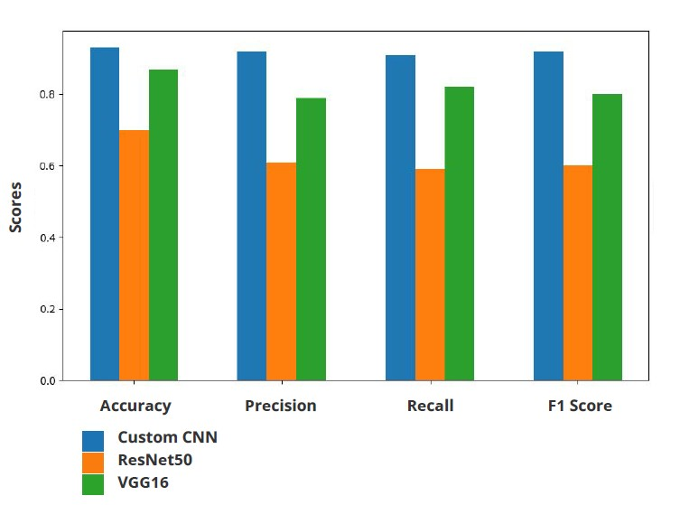

**Solid class:**

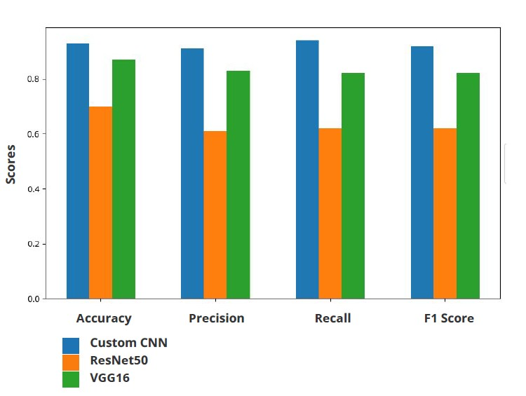

**Wire Good class:**

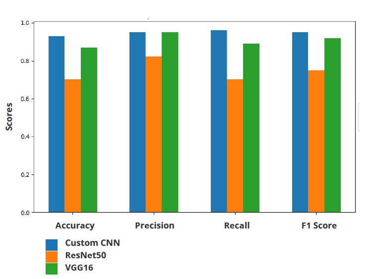

**Wire Bad class:**

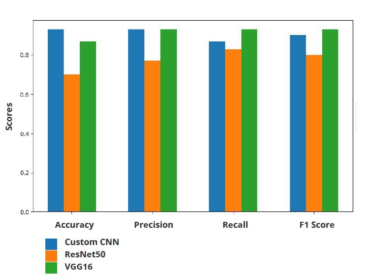

| Model | Accuracy | Notes |
|---|---|---|
| **Custom CNN** | **93%** | Best overall, lightweight, no ImageNet pre-training needed |
| VGG16 + Top Layer | 87% | Transfer learning; competitive on Wire classes |
| ResNet50 + Top Layer | 70% | Under-performed. ImageNet features don't transfer well to height maps |

The custom CNN outperforms both transfer-learning models across all classes. LLS height-map data is structurally very different from natural images, so ImageNet pre-training provides limited benefit here.

---

## Repository Structure

```
├── Data_Preprocessing.ipynb     # Outlier cleaning, segmentation, rotation augmentation
├── Custom_CNN_Model.ipynb       # Custom CNN: training, evaluation, confusion matrix
├── VGG16_Model.ipynb            # VGG16 fine-tuning: training, evaluation, confusion matrix
├── ResNet_50_Model.ipynb        # ResNet50 fine-tuning: training, evaluation, confusion matrix
├── requirements.txt             # Python dependencies
└── images/                      # Images used in this README
```

---

## Getting Started

### 1. Clone the repository

```bash
git clone https://github.com/<your-username>/3d-print-insitu-monitoring-cnn.git
cd 3d-print-insitu-monitoring-cnn
```

### 2. Install dependencies

```bash
pip install -r requirements.txt
```

### 3. Configure paths

Every notebook has a **Configuration cell** near the top. Set `DATA_ROOT` to your augmented CSV folder and `MODEL_SAVE_PATH` to where you want saved models written:

```python
DATA_ROOT       = "/content/drive/MyDrive/your-folder/Data_augmentation_updated"
MODEL_SAVE_PATH = "/content/drive/MyDrive/your-folder"
```

All other constants (`IMG_SIZE`, `NORM_FACTOR`, `NUM_CLASSES`, etc.) are defined in the same cell, no other cells need editing.

### 4. Run order

```
1. Data_Preprocessing.ipynb    <- generate augmented CSVs first
2. Custom_CNN_Model.ipynb      <- train & evaluate Custom CNN
3. VGG16_Model.ipynb           <- train & evaluate VGG16
4. ResNet_50_Model.ipynb       <- train & evaluate ResNet50
```

The notebooks are designed for **Google Colab** with Drive mounting. Open in Colab, run the Drive mount cell, update the two config paths, then **Run All**.

---

## Key Findings

- CNNs can reliably classify LLS height maps into four print-topology classes with no manual feature engineering
- A lightweight custom CNN (93%) outperforms off-the-shelf transfer-learning models because ImageNet features do not generalise well to single-channel depth data
- Real-time classification can feed a closed-loop feedback controller, stopping the printer the moment a *Wire Bad* layer is detected

---

## Author

**Muhammad Irtaza Khan**  
MSc Computational Modeling and Simulation — TU Dresden
